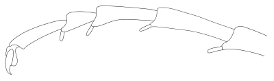

## Introduction  
This key is based on the work of Gauld and Bolton (1988).   
Gauld, I., Bolton, B. (1988). The Hymenoptera. British Museum (Natural History), London.   
The key was prepared using DKey software (Tofilski 2018).  
Tofilski A., 2018. DKey software for editing and browsing dichotomous keys. ZooKeys 735: 131-140. [<u>https://doi.org/10.3897/zookeys.735.21412</u>](https://doi.org/10.3897/zookeys.735.21412)  
  
## Taxonomic key

[1]{#k1}

::: columns
::: column
Body without a marked constriction between the 1st and 2nd abdominal segments (Fig. [58](#f16), [64](#f20)).  
Wings: fully developed, fore wing: with an enclosed anal cell (Fig. [16](#f3), [59](#f17), [61](#f19)).  
[Symphyta] - [2](#k2)
  
. (Maria Komorowska, CC BY-NC 3.0, after Gauld and Bolton 1988)"){style="border:1px solid black;"} - fore wing. (CC0, from Gauld and Bolton 1988)"){style="border:1px solid black;"}"){style="border:1px solid black;"}"){style="border:1px solid black;"}"){style="border:1px solid black;"}
:::
::: column
Body with a constriction between the 1st and 2nd abdominal segments (Fig. [121](#f45)), if the constrictipn is secondarily obscured (Fig. [96](#f38)) than fore wing without enclosed cells.  
Wings: fully developed, vestigal or absent, fore wing: if present then without an enclosed anal cell (Fig. [17](#f4), [76](#f26), [115](#f40)).  
[Apocrita] - [7](#k7)
  
"){style="border:1px solid black;"}"){style="border:1px solid black;"} - fore wing. (Jakub Więckowski, CC BY-NC 3.0, after Gauld and Bolton 1988)"){style="border:1px solid black;"}
:::
:::

[2(<a href="#k1">1</a>)]{#k2}

::: columns
::: column
Antenna: inserted on ventral side of head, close to mandibles (Fig. [40](#f5)).  
Anal cell of fore wing: indistinctly delineated. - Orussoidea
  
"){style="border:1px solid black;"}
:::
::: column
Antenna: inserted on anterior side of head, away from mandibles.  
Anal cell of fore wing: distinct. - [3](#k3)
:::
:::

[3(<a href="#k2">2</a>)]{#k3}

::: columns
::: column
Vein RS of fore wing: branched (Fig. 57).  
Antenna: with third segment long and stout, followed by a filament of 9 or more slender segments (Fig. [41](#f6)). - Xyeloidea
  
"){style="border:1px solid black;"}
:::
::: column
Vein RS of fore wing: unbranched.  
Antenna: different. - [4](#k4)
:::
:::

[4(<a href="#k3">3</a>)]{#k4}

::: columns
::: column
Fore tibia: with one apical spur, if the second spur is present it is much shorter or vestigal. - [5](#k5)
:::
::: column
Fore tibia: with two well-developed apical spurs, both apical spurs are of similar size. - [6](#k6)
:::
:::

[5(<a href="#k4">4</a>)]{#k5}

::: columns
::: column
Cenchri: absent (Fig. [42](#f7)).  
Abdomen: terminally laterally compressed, anteriorly slightly constricted between first and second segments (Fig. 74). - Cephoidea
  
"){style="border:1px solid black;"}
:::
::: column
Cenchri: present (Fig. [43](#f8)).  
Abdomen: cylindrical or depressed, not constricted anteriorly (Fig. [72](#f23), [73](#f24)). - Siricoidea
  
"){style="border:1px solid black;"}. (CC0, after Gauld and Bolton 1988)"){style="border:1px solid black;"} - fore wing. (Natalia Malinowska, CC BY-NC 3.0, after Gauld and Bolton 1988)"){style="border:1px solid black;"}
:::
:::

[6(<a href="#k4">4</a>)]{#k6}

::: columns
::: column
Pronotum: in dorsal view with hind margin more or less straight (Fig. [44](#f9)).  
Vein 2r-rs of fore wing: present.  
Labrum: concealed (Fig. [46](#f11)).  
Mid tibiae and hind tibiae: with preapical spurs.  
Antenna with 18 or more segments (Fig. [58](#f16)). - Megalodontoidea
  
"){style="border:1px solid black;"}"){style="border:1px solid black;"}. (Maria Komorowska, CC BY-NC 3.0, after Gauld and Bolton 1988)"){style="border:1px solid black;"}
:::
::: column
Pronotum: in dorsal view with hind margin strongly bowed (Fig. [45](#f10), or if weakly bowed then fore wing with 2r-rs absent.  
Vein 2r-rs of fore wing: present or absent.  
Labrum: exposed (Fig. [47](#f12)).  
Mid tibiae and hind tibiae: without preapical spurs, if preapical spurs present, then antenna with fewer than 10 segments.  
Antenna: with 3-32 segments, often with 9 or less. - Tenthredinoidea
  
"){style="border:1px solid black;"}"){style="border:1px solid black;"}
:::
:::

[7(<a href="#k1">1</a>)]{#k7}

::: columns
::: column
Segment 1 of gaster forming a node or scale, or first two segments nodiform, so segment 2 is deeply separated (both dorsally and ventrally) from segments 1 and 3 (Fig. 143). - Vespoidea (part)
:::
::: column
Segment 1 of gaster not scale-like, if rarely slightly nodiform then with segment 2 closely adapted to segment 3. - [8](#k8)
:::
:::

[8(<a href="#k7">7</a>)]{#k8}

::: columns
::: column
Segment 1 of gaster inserted high up on propodeum so gap between propodeal foramen and insertion of hind coxa is about equal to or greater than gap between foramen and hind margin of metanotum (Fig. [79](#f29)-[80](#f30)). - [9](#k9)
  
 - wings. (Sara Prystupa, CC BY-NC 3.0, after Gauld and Bolton 1988)"){style="border:1px solid black;"} - fore wing. (Weronika Stelnicka, CC BY-NC 3.0, after Gauld and Bolton 1988)"){style="border:1px solid black;"}
:::
::: column
Segment 1 of gaster inserted low down on propodeum so gap between propodeal foramen and insertion of hind coxa is very much less than gap between foramen and hind margin of metanotum. - [10](#k10)
:::
:::

[9(<a href="#k8">8</a>)]{#k9}

::: columns
::: column
Antenna: with 14 or fewer segments.  
Fore wing with costal cell distinct (Fig. [79](#f29), [80](#f30)). - Evanioidea
  
 - wings. (Sara Prystupa, CC BY-NC 3.0, after Gauld and Bolton 1988)"){style="border:1px solid black;"} - fore wing. (Weronika Stelnicka, CC BY-NC 3.0, after Gauld and Bolton 1988)"){style="border:1px solid black;"}
:::
::: column
Antenna: with 18 or more segments.  
Fore wing with costal cell obliterated, veins C, Sc, R and Rs fused between wing base and pterostigma (Fig. [120](#f44)) - Ichneumonoidea (part)
  
 - fore wing. (Tymoteusz Tuttas, CC BY-NC 3.0, after Gauld and Bolton 1988)"){style="border:1px solid black;"}
:::
:::

[10(<a href="#k8">8</a>)]{#k10}

::: columns
::: column
Wings: fully developed. - [11](#k11)
:::
::: column
Wings: vestigal or absent. - [25](#k25)
:::
:::

[11(<a href="#k10">10</a>)]{#k11}

::: columns
::: column
Fore wing with one enclosed cell, or without any enclosed cells (Fig. 98, 99, 100, 108; 111, 112, 113; 132) - [12](#k12)
:::
::: column
Fore wing with two or more cells clearly delineated by veins (Fig. 14, [15](#f2), 81, 110, 119, [120](#f44), [121](#f45), 122, 144). - [19](#k19)
  
"){style="border:1px solid black;"} - fore wing. (Tymoteusz Tuttas, CC BY-NC 3.0, after Gauld and Bolton 1988)"){style="border:1px solid black;"}
:::
:::

[12(<a href="#k11">11</a>)]{#k12}

::: columns
::: column
Fore wing with membrane reticulate; hind wing vestigial, with a bifid apex; segments 1 and 2 of gaster cylindrical, slender, forming a 2-segmented petiole (Fig. 48) (Body length less than 1 mm). - Chalcidoidea (part)
:::
::: column
Fore wing membrane not reticulate; hind wing fully developed though often very narrow, but never with a bifid apex; gaster with at most first segment cylindrical and slender so petiole, if present, is 1-segmented. - [13](#k13)
:::
:::

[13(<a href="#k12">12</a>)]{#k13}

::: columns
::: column
Hind wing with a distinct stalk (Fig. 49). - Chalcidoidea (part)
:::
::: column
Hind wing not stalked. - [14](#k14)
:::
:::

[14(<a href="#k13">13</a>)]{#k14}

::: columns
::: column
Alitrunk with pronotum not extending back to tegulae (Fig. 50); wings without enclosed cells. - Chalcidoidea (part)
:::
::: column
Alitrunk with pronotum extending back to almost touch tegulae (Fig. [51](#f13)); wings with or without closed cells. - [15](#k15)
  
"){style="border:1px solid black;"}
:::
:::

[15(<a href="#k14">14</a>)]{#k15}

::: columns
::: column
Antennae inserted in centre of face, their sockets separated from the clypeus by more than twice their own diameter. - [16](#k16)
:::
::: column
Antennae inserted on face close to clypeus, their sockets separated from clypeus by about their own diameter or less. - [17](#k17)
:::
:::

[16(<a href="#k15">15</a>)]{#k16}

::: columns
::: column
Antennae not inserted on a promontory or “shelf”, those of female without a very elongate scape;   
fore wing venation characteristic (Fig. [84](#f33), [85](#f34), 86), with a fairly large radial cell, that is either open anteriorly, or the only enclosed cell in the wing;   
costal cell broad, anteriorly open, posteriorly bordered by a vein from which arises a long stub of Rs+M. - Cynipoidea (part)
  
 - fore wing. (Kinga Ślęczek, CC BY-NC 3.0, after Gauld and Bolton 1988)"){style="border:1px solid black;"} - fore wing. (Maja Tomaszewska, CC BY-NC 3.0, after Gauld and Bolton 1988)"){width="401" style="border:1px solid black;"}
:::
::: column
Antennae inserted on facial promontory or “shelf”, those of female geniculate, scape more than 3x as long as wide;   
fore wing without venation, or with a single linear vein, without a discernible radial cell, or if one is indicated then it is not defined distally and costal cell is only enclosed cell;   
if costal cell present, vein delineating costal cell posteriorly is without a stub of Rs+M (Fig. 111). - Proctotrupoidea (part)
:::
:::

[17(<a href="#k15">15</a>)]{#k17}

::: columns
::: column
Head distinctly prognathous;   
tergite 1 of gaster as long as following tergites, separated from sternite, posteriorly overlapping tergite 2 (Fig. 135) - Chrysidoidea (part)
:::
::: column
Head hypognathous;   
tergite 1 of gaster shorter than the following apparent tergite (which may be a syntergite), or the two fused and tergite 1 visible as a ridged anterior rim of the first apparent tergite; tergite 1 usually fused with sternite to form a ring at anterior end of gaster. - [18](#k18)
:::
:::

[18(<a href="#k17">17</a>)]{#k18}

::: columns
::: column
Fore wing with vein along anterior margin, this vein distally with a curved stigmal branch, sometimes with a large pterostigma (Fig. 53, 113);   
fore tibia with two spurs - Ceraphronoidea (part)
:::
::: column
Fore wing without any venation, or with a short vein that does not reach to level of middle of wing, or if with a long vein, then this is proximally separated from anterior margin of wing, and its stigmal branch is almost straight; pterostigma not present (Fig. 112);   
fore tibia with a single spur. - Proctotrupoidea (part)
:::
:::

[19(<a href="#k11">11</a>)]{#k19}

::: columns
::: column
Tarsi with well-developed plantar lobes (Fig. 54);   
antenna with 26-27 segments;   
fore wing with 10 enclosed cells (Fig. [75](#f25)). - Trigonalyoidea
  
{style="border:1px solid black;"} - wing. (Tomasz Orkisz, CC BY-NC 3.0, after Gauld and Bolton 1988)"){style="border:1px solid black;"}
:::
::: column
Tarsi without plantar lobes, or if vestiges present then antenna with fewer than 14 segments;   
antenna with various numbers of segments, if more than 14 then fore wing with 7 or fewer enclosed cells;   
fore wing with 1-10 enclosed cells. - [20](#k20)
:::
:::

[20(<a href="#k19">19</a>)]{#k20}

::: columns
::: column
Fore wing with costal cell obliterated, veins C, Sc, R and Rs fused or contiguous from wing base to pterostigma;   
hind wing without a distinct jugal lobe (Fig. 119, [120](#f44), [121](#f45), 122);   
antenna usually with 16 or more segments (rarely with as few as 12), and with a small anellus more or less differentiated from proximal end of 1st flagellar segment - Ichneumonoidea (part)
  
 - fore wing. (Tymoteusz Tuttas, CC BY-NC 3.0, after Gauld and Bolton 1988)"){style="border:1px solid black;"}
:::
::: column
Fore wing with costal cell usually visible, though sometimes not bordered anteriorly by a vein, rarely when costal cell is virtually obliterated then a distinct jugal lobe is present on the hind wing;   
jugal lobe otherwise present or absent;   
antenna with 10-15 segments, without a small anellus differentiated from proximal end of 1st flagellar segment (except in one taxon with a broad costal cell). - [21](#k21)
:::
:::

[21(<a href="#k20">20</a>)]{#k21}

::: columns
::: column
Fore wing with costal cell open, not delineated by a vein along anterior margin of wing;   
pterostigma absent;   
gaster laterally compressed (Fig. 81). - Cynipoidea (part)
:::
::: column
Fore wing with costal cell enclosed, bordered anteriorly by a vein, or if this vein is rarely absent then pterostigma is present, or costal cell is obliterated;   
pterostigma otherwise present, or uncommonly, absent;   
gaster cylindrical or depressed - [22](#k22)
:::
:::

[22(<a href="#k21">21</a>)]{#k22}

::: columns
::: column
First tergite of gaster short, fused with sternite to form a ring-like, highly sclerotized segment; second tegite (or syntergite) longer than tergites 1 and 3+ combined (Fig. [52](#f14)); spiracles not present at least on first and apparent second gastral tergites; fore wing usually with 2 enclosed cells (costal and radial)(Fig. 110), rarely with up to 3 more enclosed cells (thus making a maximum of 5)(Fig. 109) - Proctotrupoidea (part)
  
"){style="border:1px solid black;"}
:::
::: column
First tergite of gaster quite long, not fused with sternite to form short ring-like segment; second tergite not longer than tergites 1 and 3+ combined; first and second segments of gaster with distinct spiracles (though these may be positioned ventrally on laterotergite); fore wing usually with 6 or more enclosed cells, rarely with 2-5 and then always with basal and subbasal cells enclosed, costal cell usually enclosed, radial cell sometimes not enclosed. - [23](#k23)
:::
:::

[23(<a href="#k22">22</a>)]{#k23}

::: columns
::: column
Fore wing with radial cell either not indicated or open distally, and without any complete submarginal (cubital) cells; hind wing without enclosed cells (Fig. 136, 137, 138). - Chrysidoidea (in part)
:::
::: column
Fore wing with an enclosed radial cell, and with at least one enclosed cubital cell; hind wing generally with two or three enclosed cells. - [24](#k24)
:::
:::

[24(<a href="#k23">23</a>)]{#k24}

::: columns
::: column
Pronotum with upper hind corner widely separated from tegulae, and lower down the side with a pronounced prontal lobe covering mesothoracic spiracle (Fig. [55](#f15)). - Apoidea
  
 - anterior part of mesosoma, lateral view. (Emilia Karaś, CC BY-NC 3.0, after Gauld and Bolton 1988)"){height="401" style="border:1px solid black;"}
:::
::: column
Pronotum with upper hind corner reaching to or close to tegula, with or without a pronounced prontal lobe (Fig. 56). - Vespoidea (part)
:::
:::

[25(<a href="#k10">10</a>)]{#k25}

::: columns
::: column
Antennae with 16 or more segments, more or less filiform, unspecialized; sternites of gaster weakly sclerotized, tending to dry with median longitudinal fold - Ichneumonoidea (part)
:::
::: column
Antenna with 15 or fewer segments, sometimes filiform and unspecialized, often geniculate with elongate scape and clavate distal segments; sternites of gaster strongly sclerotized . - [26](#k26)
:::
:::

[26(<a href="#k25">25</a>)]{#k26}

::: columns
::: column
Fore, mid and hind tarsi 3-segmented. - Chalcidoidea (part)
:::
::: column
All tarsi with 4 or 5 segments. - [27](#k27)
:::
:::

[27(<a href="#k26">26</a>)]{#k27}

::: columns
::: column
Upper hind corner of pronotum separated from tegula by a prepectus - Chalcidoidea (part)
:::
::: column
Upper hind corner of prontum more or less touching tegula, or with tegula absent - [28](#k28)
:::
:::

[28(<a href="#k27">27</a>)]{#k28}

::: columns
::: column
First segment of gaster more or less conical, not dorsally fused with tegite 2; tergites 1 and 2 with spiracles. - [29](#k29)
:::
::: column
First segment of gaster cylindrical or annular, or minute, indistinct, fused dorsally with tergite 2; tergites 1 and 2 without spiracles. - [31](#k31)
:::
:::

[29(<a href="#k28">28</a>)]{#k29}

::: columns
::: column
Antenna with 10 segments. - Chrysidoidea (part)
:::
::: column
Antenna with 11-13 segments. - [30](#k30)
:::
:::

[30(<a href="#k29">29</a>)]{#k30}

::: columns
::: column
Head prognathous and dorsoventrally flattened; clypeus with a median carina extending between antennae. - Chrysidoidea (part)
:::
::: column
Head hypognathous, not dorsoventrally flattened; clypeus lacking a median carina that extends between antennae. - Vespoidea (part)
:::
:::

[31(<a href="#k28">28</a>)]{#k31}

::: columns
::: column
Antenna never geniculate, the scape only slightly longer than broad, and slightly shorter than first flagellar segment; gaster laterally compressed - Cynipoidea (part)
:::
::: column
Female (the most commonly encountered brachypterous or apterous sex) with antenna geniculate, the scape elongate, at least twice the length of the first flagellar segment; gaster of both sexes cylindrical or depressed. - [32](#k32)
:::
:::

[32(<a href="#k31">31</a>)]{#k32}

::: columns
::: column
Anterior tibia with two apical spurs. - Ceraphronoidea (part)
:::
::: column
Anterior tibia with one apical spur. - [33](#k33)
:::
:::

[33(<a href="#k32">32</a>)]{#k33}

::: columns
::: column
Antennal socket separated from clypeus by its own diameter or less; first segment of gaster with tergite and sternite separate; tergite 8 without spiracle; antenna with 12 or fewer segments. - Proctotrupoidea (part)
:::
::: column
Antennal socket separated from clypeus by more than twice its own diameter; first segment of gaster with tergite and sternite fused; tergite 8 with spiracle; antenna almost always with 13 or more segments. - [34](#k34)
:::
:::

[34(<a href="#k33">33</a>)]{#k34}

::: columns
::: column
Gaster, especially in females, laterally compressed; antenna of female 14-segmented, of male 13-segmented; ovipositor concealed; head without shelf-like process; cerci absent; ovipositor opening ventral. - Cynipoidea (part)
:::
::: column
Gaster usually cylindrical; antennae with various numbers of segments, if 14-segmented in female or 13-segmented in male then ovipositor exposed or antenna mounted on a shelf-like process of the face; cerci present; ovipositor opening terminal - Proctotrupoidea (part)
:::
:::
## Figures  
1.   
  
2. Fig. 15. Ichneumonidae - fore wing. (CC0, after Gauld and Bolton 1988)  
"){style="border:1px solid black;"}  
  
3. Fig. 16. Xyelidae - fore wing. (Joanna Jurkowska, CC BY-NC 3.0, after Gauld and Bolton 1988)  
"){style="border:1px solid black;"}  
  
4. Fig. 17. Apidae - wings. (Gabriela Karaszkiewicz, CC BY-NC 3.0, after Gauld and Bolton 1988)  
"){style="border:1px solid black;"}  
  
5. Fig. 40. Orussus - head, anterior view. (Adam Tofilski, CC BY-NC 3.0, after Gauld and Bolton 1988)  
"){style="border:1px solid black;"}  
  
6. Fig. 41. Xyela - antenna. (Adam Tofilski, CC BY-NC 3.0, after Gauld and Bolton 1988)  
"){style="border:1px solid black;"}  
  
7. Fig. 42. Cephus - abdomen, dorsal view. (Adam Tofilski, CC BY-NC 3.0, after Gauld and Bolton 1988)  
"){style="border:1px solid black;"}  
  
8. Fig. 43. Sirex - abdomen, dorsal view. (Adam Tofilski, CC BY-NC 3.0, after Gauld and Bolton 1988)  
"){style="border:1px solid black;"}  
  
9. Fig. 44. Megalodontes - pronotum, dorsal view. (Julia Zawada, CC BY-NC 3.0, after Gauld and Bolton 1988)  
"){style="border:1px solid black;"}  
  
10. Fig. 45. Tenthredo - pronotum, dorsal view. (Kinga Ślęczek, CC BY-NC 3.0, after Gauld and Bolton 1988)  
"){style="border:1px solid black;"}  
  
11. Fig. 46. Megalodontes - head, anterior view. (Maja Tomaszewska, CC BY-NC 3.0, after Gauld and Bolton 1988)  
"){style="border:1px solid black;"}  
  
12. Fig. 47. Tenthredo - head, anterior view. (Weronika Stelnicka, CC BY-NC 3.0, after Gauld and Bolton 1988)  
"){style="border:1px solid black;"}  
  
13. Fig. 51. Proctotrupes - anterior part of mesosoma, lateral view. (Aleksandra Kwiecień, CC BY-NC 3.0, after Gauld and Bolton 1988)  
"){style="border:1px solid black;"}  
  
14. Fig. 52. Proctotrupes - metasoma, lateral view. (Maria Komorowska, CC BY-NC 3.0, after Gauld and Bolton 1988)  
"){style="border:1px solid black;"}  
  
15. Fig. 55. Ectemnius (Sphecidae) - anterior part of mesosoma, lateral view. (Emilia Karaś, CC BY-NC 3.0, after Gauld and Bolton 1988)  
 - anterior part of mesosoma, lateral view. (Emilia Karaś, CC BY-NC 3.0, after Gauld and Bolton 1988)"){height="401" style="border:1px solid black;"}  
  
16. Fig. 58. *Pamphilius sylvaticus* (Pamphiliidae). (Maria Komorowska, CC BY-NC 3.0, after Gauld and Bolton 1988)  
. (Maria Komorowska, CC BY-NC 3.0, after Gauld and Bolton 1988)"){style="border:1px solid black;"}  
  
17. Fig. 59. Blasticotoma - fore wing. (Zofia Kościuszko, CC BY-NC 3.0, after Gauld and Bolton 1988)  
"){style="border:1px solid black;"}  
  
18. Fig. 60. Cimbex - antenna. (Adam Tofilski, CC BY-NC 3.0, after Gauld and Bolton 1988)  
"){style="border:1px solid black;"}  
  
19. Fig. 61. Tenthredo - fore wing. (Dagmara Kowalczyk, CC BY-NC 3.0, after Gauld and Bolton 1988)  
"){style="border:1px solid black;"}  
  
20. Fig. 64. *Arge pagana* (Argidae) - fore wing. (CC0, from Gauld and Bolton 1988)  
 - fore wing. (CC0, from Gauld and Bolton 1988)"){style="border:1px solid black;"}  
  
21. Fig. 65. Diprion pini (Diprionidae) - fore wing. (Liszka Joanna, CC BY-NC 3.0, after Gauld and Bolton 1988)  
 - fore wing. (Liszka Joanna, CC BY-NC 3.0, after Gauld and Bolton 1988)"){style="border:1px solid black;"}  
  
22. Fig. 66. Tenthredo arcuata (Tenthredinidae) - fore wing. (Agnieszka Łatka, CC BY-NC 3.0, after Gauld and Bolton 1988)  
 - fore wing. (Agnieszka Łatka, CC BY-NC 3.0, after Gauld and Bolton 1988)"){style="border:1px solid black;"}  
  
23. Fig. 72. Urocerus gigas (Siricidae). (CC0, after Gauld and Bolton 1988)  
. (CC0, after Gauld and Bolton 1988)"){style="border:1px solid black;"}  
  
24. Fig. 73. Xiphydria (Xiphydriidae) - fore wing. (Natalia Malinowska, CC BY-NC 3.0, after Gauld and Bolton 1988)  
 - fore wing. (Natalia Malinowska, CC BY-NC 3.0, after Gauld and Bolton 1988)"){style="border:1px solid black;"}  
  
25. Fig. 75. Trigonalis hahnii (Trigonalyidae) - wing. (Tomasz Orkisz, CC BY-NC 3.0, after Gauld and Bolton 1988)  
 - wing. (Tomasz Orkisz, CC BY-NC 3.0, after Gauld and Bolton 1988)"){style="border:1px solid black;"}  
  
26. Fig. 76. Aulacus - fore wing. (Wiktoria Pachel, CC BY-NC 3.0, after Gauld and Bolton 1988)  
"){style="border:1px solid black;"}  
  
27. Fig. 77. Evania - fore wing. (Jakub Pacyga, CC BY-NC 3.0, after Gauld and Bolton 1988)  
"){style="border:1px solid black;"}  
  
28. Fig. 78. Aulacus - head. (Adam Tofilski, CC BY-NC 3.0, after Gauld and Bolton 1988)  
"){height="401" style="border:1px solid black;"}  
  
29. Fig. 79. Brachygaster minuta (Evaniidae) - wings. (Sara Prystupa, CC BY-NC 3.0, after Gauld and Bolton 1988)  
 - wings. (Sara Prystupa, CC BY-NC 3.0, after Gauld and Bolton 1988)"){style="border:1px solid black;"}  
  
30. Fig. 80. Gasteruptrion jucator (Gasteruptiidae) - fore wing. (Weronika Stelnicka, CC BY-NC 3.0, after Gauld and Bolton 1988)  
 - fore wing. (Weronika Stelnicka, CC BY-NC 3.0, after Gauld and Bolton 1988)"){style="border:1px solid black;"}  
  
31. Fig. 82. Figites - fore wing. (Tymoteusz Tuttas, CC BY-NC 3.0, after Gauld and Bolton 1988)  
"){style="border:1px solid black;"}  
  
32. Fig. 83. Andricus (Cynipidae) - fore wing. (Karolina Szmyracha, CC BY-NC 3.0, after Gauld and Bolton 1988)  
 - fore wing. (Karolina Szmyracha, CC BY-NC 3.0, after Gauld and Bolton 1988)"){style="border:1px solid black;"}  
  
33. Fig. 84.  Anacharis eucharioides (Figitidae) - fore wing. (Kinga Ślęczek, CC BY-NC 3.0, after Gauld and Bolton 1988)  
 - fore wing. (Kinga Ślęczek, CC BY-NC 3.0, after Gauld and Bolton 1988)"){style="border:1px solid black;"}  
  
34. Fig. 85. Tribliographa rapae (Eucoilidae) - fore wing. (Maja Tomaszewska, CC BY-NC 3.0, after Gauld and Bolton 1988)  
 - fore wing. (Maja Tomaszewska, CC BY-NC 3.0, after Gauld and Bolton 1988)"){width="401" style="border:1px solid black;"}  
  
35. Fig. 88. Arrhenophagus (Encyrtidae) - fore   
wing. (Dagmara Kowalczyk, CC BY-NC 3.0, after Gauld and Bolton 1988)  
 - fore wing. (Dagmara Kowalczyk, CC BY-NC 3.0, after Gauld and Bolton 1988)"){style="border:1px solid black;"}  
  
36. Fig. 89. Arrhenophagus - head, anterior facial view. (Karolina Szmyracha, CC BY-NC 3.0, after Gauld and Bolton 1988)  
"){style="border:1px solid black;"}  
  
37. Fig. 92. Torymus - fore wing. (Adam Tofilski, CC BY-NC 3.0, after Gauld and Bolton 1988)  
"){style="border:1px solid black;"}  
  
38. Fig. 96. *Thysanus ater* (Signiphoridae), female - dorsal view.  
  
39. Fig. 114. Banchus (Ichneumonidae) - hind wing. (Adam Tofilski, CC BY-NC 3.0, after Gauld and Bolton 1988)  
 - hind wing. (Adam Tofilski, CC BY-NC 3.0, after Gauld and Bolton 1988)"){style="border:1px solid black;"}  
  
40. Fig. 115.  Banchus (Ichneumonidae) - fore wing. (Jakub Więckowski, CC BY-NC 3.0, after Gauld and Bolton 1988)  
 - fore wing. (Jakub Więckowski, CC BY-NC 3.0, after Gauld and Bolton 1988)"){style="border:1px solid black;"}  
  
41. Fig. 117. Macrocentrus - fore wing. (Julia Zawada, CC BY-NC 3.0, after Gauld and Bolton 1988)  
"){style="border:1px solid black;"}  
  
42. Fig. 124. Dolichurus (Sphecidae) - fore wing. (Adam Tofilski, CC BY-NC 3.0, after Gauld and Bolton 1988)  
 - fore wing. (Adam Tofilski, CC BY-NC 3.0, after Gauld and Bolton 1988)"){style="border:1px solid black;"}  
  
43. Fig. 115. *Banchus* - fore wing.  
 - fore wing. (Jakub Więckowski, CC BY-NC 3.0, after Gauld and Bolton 1988)"){style="border:1px solid black;"}  
  
44. Fig. 120. Amblyteles armatorius (Ichneumonidae) - fore wing. (Tymoteusz Tuttas, CC BY-NC 3.0, after Gauld and Bolton 1988)  
 - fore wing. (Tymoteusz Tuttas, CC BY-NC 3.0, after Gauld and Bolton 1988)"){style="border:1px solid black;"}  
  
45. Fig. 121. *Meteorus ictericus* (Braconidae), female - dorsal view.  
  
